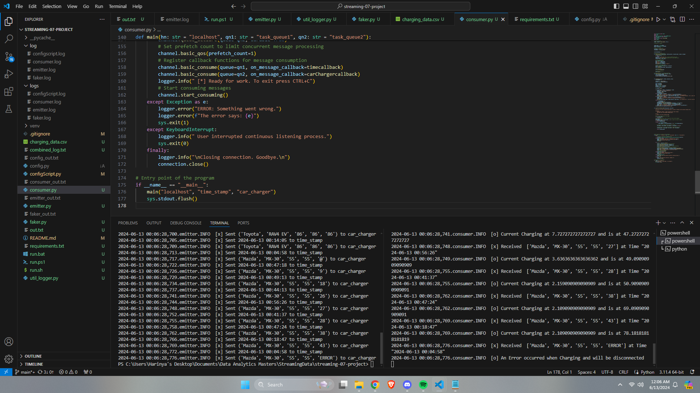

# Streaming Analytics Project - Car Charger 

## Description
This project presents a real-time streaming analytics pipeline using Python, RabbitMQ, and email notifications. Simulated charging data for electric vehicles (EVs) is generated and processed in real-time, with the added functionality of sending email notifications based on predefined criteria. I was intretesed in trying to stimulate this as I have used ecletric charges and wanted to see how hard it would be to stimulate one. 

## Data Sources
The charging data is simulated using Python's random module, encompassing attributes such as timestamp, make, model, battery size, charging limit, and current charge. No external data sources are incorporated.
- faker.py

## Process Overview
### Data Creation 
Python scripts (`faker.py`) generate simulated charging data, including:
- **Timestamp:** The date and time of the data point.
- **Make:** The manufacturer of the EV.
- **Model:** The model of the EV.
- **Battery Size (kWh):** The total capacity of the EV's battery.
- **Charging Limit (%):** The maximum allowable charge percentage.
- **Current Charge (%):** The current charge percentage at each data point.

### Producer
- Creates the Queues and sends the messages. 
- Fromats the data from a dictinry tuple to a string in order to be sent. 

### RabbitMQ Exchange
- Data is published to a RabbitMQ exchange for distribution to multiple consumers.
- The exchange ensures reliable delivery and queuing of the data for real-time processing.

### Queue
- Consumers subscribe to a queue to receive real-time charging data.

### Consumers
- Python scripts (`consumer.py`) consume the data from the queue, perform analytics, and generate insights.
- Consumers process each data point to monitor charging status and detect anomalies such as charging errors or completed charges.

### Email Notifications
- The system includes functionality to send email notifications based on specific criteria derived from the analyzed data.
- Notifications are triggered for events like charging completion or errors during charging.

## Output
The output of the simulation encompasses various stages:
- **Generation of Simulated Charging Data:** Data is created using the `faker.py` script.
- **Publishing Data to RabbitMQ:** The `emitter.py` script publishes data to the RabbitMQ exchange.
- **Consumption of Data from RabbitMQ:** The `consumer.py` script consumes data from the RabbitMQ queue.
- **Real-time Processing and Analysis:** Consumers analyze the streaming data in real-time, checking for predefined criteria.
- **Email Notifications:** Emails are sent based on conditions such as charging completion or errors.
- **Logging:** All actions are logged, and the combined logs are stored in `out.txt` for review.

## Execution Instructions
### Prerequisites
1. **Python Installation:** Ensure Python is installed on your system.
2. **RabbitMQ Installation:** Install RabbitMQ and ensure it is running.

### Steps for Manual Execution 
1. **Clone the Repository:**
   ```sh
   git clone https://github.com/your-repo/streaming-analytics.git
   cd streaming-analytics
2. **Setup Virtual Environment:**
    For Windows:
    ```sh
    python -m venv venv
    .\venv\Scripts\activate
3. **Install Dependencies:**
    ```sh
    pip install -r requirements.txt
4. **Run Configuration Script:**
    ```sh
    python configScript.py
5. **Generate Charging Data:**
    ```sh
    python faker.py
6. **Start the Consumer:**
    ```sh
    python consumer.py
7. **Start the Emitter:**
    ```sh
    python emitter.py
8. **Stop the Consumer:**
    Allow the consumer to run and process data. Manually stop the consumer (Ctrl+C) after a period.

### Automated Script
To simplify the execution process, a script is provided (run.bat for Windows) that runs the entire program:
- configScript.py
- faker.py
- emitter.py
- consumer.py
- Combines logs into out.txt after execution.

### Logging
Logs are stored in the log directory and combined into out.txt upon completion. As well as after you own execution logs for each file will be stored in the logs folder. 

### Results Verification
- Console Output: View the out.txt file for combined log output from all scripts.
- Screenshots: Refer to the screenshots below. 

Image of the code running 


Image of Email notifcation 


Image of RabbitMQ Dashboard
